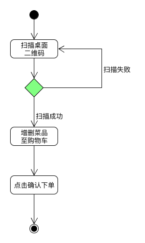
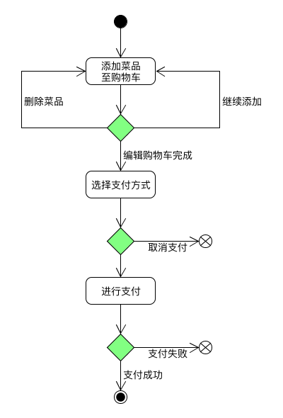

# 用例图

## Detail Use Case
用例:下订单

经营范围:自助点餐系统

级别:用户目标

主要参与者:客户

### 角色
顾客:他们想知道餐厅和菜品的详细信息，这样他们就可以根据自己的喜好下订单。

商家:他们提供不同种类的食物，希望卖得好。此外，他们想从销售分析中了解客户的偏好，从而提高服务质量。

### 前置条件
商家需要在系统注册，并提供食品的菜单。

### 主场景
1.顾客选择餐厅的餐桌。

2.顾客扫描桌子上的二维码。

3.商家根据存货及时更新菜单。

4.顾客浏览菜单来选择他们喜欢的菜。

5.顾客为每道菜指定自己的个人口味。

6.顾客把菜品放进购物车。

7.厨师按顺序完成菜品。

8.商家把菜品端给顾客。

9.顾客享受他们的餐食，并在离开前付款。

10.钱转入商家的账户，电子发票将发送到顾客的手机上。

### 用例图
1.扫码点餐用例  

2.下单用例  
