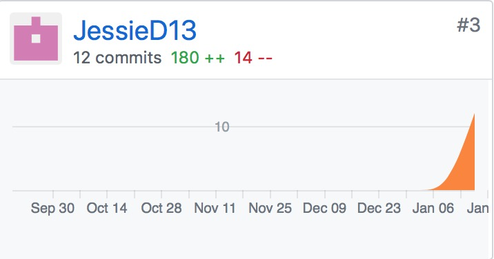

# Final Report

## 自我总结
本次项目我担任了产品经理的角色，负责产品需求规格说明和设计文档，并给出各迭代周期的需求建议，完成了需求分析、用例图、领域模型、状态模型、顺序图等。

## PSP2.1统计表

| PSP阶段                    | 耗时(h) |
| -------------------------- | ------- |
| 计划                       | 1       |
| ·  估计任务时间            | 1       |
| 开发                       | 71     |
| ·  分析需求                | 20       |
| ·  生成设计文档            | 30      |
| ·  设计复审                | 10       |
| ·  代码规范                | 1       |
| ·  具体设计                | 10       |
| ·  具体编码                | 0     |
| ·  代码复审                | 0       |
| ·  测试                    | 0       |
| 报告                       | 1       |
| ·测试报告                  | 0       |
| ·计算工作量                | 1       |
| 事后总结，提出过程改进计划 | 2       |
| **合计**                   | 75     |

## GIT统计报告

## 最有价值的工作
完成了项目的需求与设计文档。