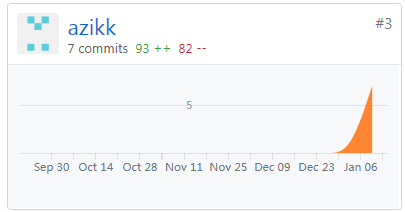

# Final Report

## 自我总结
本次参与了项目的数据库设计和API设计工作，同时辅助完成了前端UI的测试。	

## PSP2.1统计表

| PSP阶段                    | 耗时(h) |
| -------------------------- | ------- |
| 计划                       | 1       |
| ·  估计任务时间            | 1       |
| 开发                       | 72     |
| ·  分析需求                | 20       |
| ·  生成设计文档            | 15      |
| ·  设计复审                | 2       |
| ·  代码规范                | 1       |
| ·  具体设计                | 30       |
| ·  具体编码                | 2     |
| ·  代码复审                | 1       |
| ·  测试                    | 1       |
| 报告                       | 2       |
| ·测试报告                  | 1       |
| ·计算工作量                | 1       |
| 事后总结，提出过程改进计划 | 1       |
| **合计**                   | 76     |

## GIT统计报告

## 最有价值的工作
学习了数据库的组成形式以及优化方法，针对饭点点餐数据库进行了设计。然后辅助API设计工作，对API设计工作有了进一步的了解。